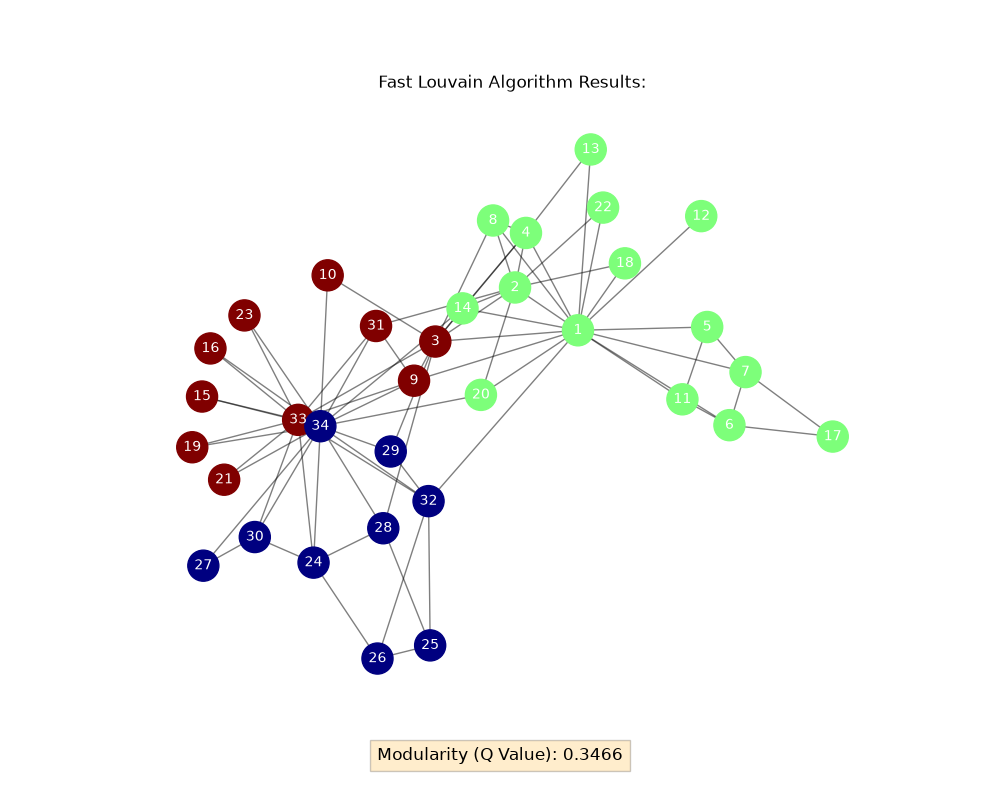

# Fast Louvain Community Detection Algorithm
A modular, runtime-dynamic Python pipeline implementing a custom local modularity optimization heuristic (the first phase of the Louvain Method) for community detection in complex networks. This project replaces a legacy, static memory C-based implementation with an abstract data pipeline utilizing `networkx` for runtime graph construction and `pandas` for handling arbitrary edge-list inputs.

## Technical Architecture

The core pipeline is decoupled into distinct functional modules to ensure scalability and ease of integration for upcoming web API layers:

* **`src/graph_processor.py`**: Handles low-level I/O tasks and data serialization. It encapsulates the pipeline's connection to `pandas`, extracting edge-lists from CSV files and converting them into memory-efficient `networkx.Graph` representations at runtime.
* **`src/fast_louvain.py`**: Contains the pure mathematical and algorithmic backbone. This module isolates the `fast_louvain` partitioning engine and modularity score computations from any visualization or disk I/O logic.
* **`main.py`**: The central orchestrator for CLI execution. It consumes the interfaces exposed by the `src` modules, runs the optimization loop, and pipes the resulting partition state into `matplotlib` for topological visualization.

## Technical Breakdown

### 1. Dynamic Graph Ingestion (`src/graph_processor.py`)
Unlike legacy matrix-based implementations ($O(V^2)$ spatial complexity) or rigid static arrays, this pipeline accepts arbitrary structural inputs at runtime. `pandas` deserializes the edge-list, which is then mapped to an undirected `networkx.Graph` object utilizing an under-the-hood adjacency dict-of-dicts structure. This guarantees $O(V + E)$ spatial efficiency, allowing immediate scalability to generic graph structures without manual memory reallocation.

### 2. Algorithmic Optimization (`src/fast_louvain.py`)
The community detection core leverages a localized, iterative modularity extraction. The algorithm initializes by sorting nodes in descending order based on their degree ($k_i$) to prioritize hub evaluation. 

The modularity delta ($dQ$) for moving a node $v$ into a candidate community $C$ is computed via:

$$dQ = \left( \frac{k_{i,in}}{2m} \right) - \left( \frac{k_i \cdot \Sigma_{tot}}{4m^2} \right)$$

Where:
- $k_{i,in}$ is the sum of link weights from node $i$ to nodes inside candidate community $C$.
- $k_i$ is the total degree (or sum of edge weights) of node $i$.
- $\Sigma_{tot}$ is the total sum of degrees of all nodes inside community $C$.
- $m$ is the total link weight (or edge count) across the entire network.

If no neighboring community yields a positive $dQ$, node $v$ isolates into a newly spawned community singleton, maximizing the global network partition quality.

### 3. Verification & Visualization Layer (`main.py`)
Post-convergence, global modularity ($Q$) is verified against empirical graph topology. The partition state dictionary (`node_id -> community_id`) is projected onto a 2D canvas using a force-directed layout algorithm (`spring_layout`). Nodes are color-mapped categorically based on their converged community signatures.

## Getting Started

### Prerequisites
Ensure your local environment runs Python 3.10 or higher. 

### Installation
1. Clone the repository and navigate to the root directory:
```bash
git clone https://github.com/UmutAA/louvain-community-detection.git
cd louvain-community-detection
```
2. Allocate and activate an isolated virtual environment:
```bash
python -m venv env
source env/bin/activate  # On Windows use: env\Scripts\activate
```
3. Instantiating upstream dependencies
```bash
pip install -r requirements.txt
```
### Execution
Execute the pipeline orchestrator from the project root:
```bash
python main.py
```

## Expected Output & Visualization

When executed, the pipeline dynamically computes the network topology and opens an interactive rendering window. Nodes belonging to the same identified community share identical categorical colors, visually proving the local modularity optimization boundaries.
Example outcome using Karate Club dataset:
